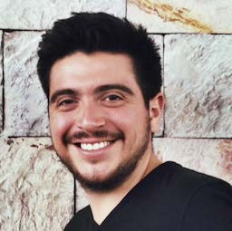

<h3>Rodrigo Ferreira</h3>

Rodrigo is a PhD Candidate in Media, Culture, and Communication at New York University. His dissertation research focuses on the techno-cultural mediation of digital technology, urban development, and material infrastructure in his native Mexico City. Previously, Rodrigo worked for over five years as Communications Specialist for Latin America at J.P. Morgan.  He holds a BA degree in Philosophy with Honors and a MA degree in Humanities and Social Thought from NYU; and has presented his work at numerous academic and art institutions such as Yale, Georgetown, Berkeley, UNAM (Mexico), ArtBo (Colombia) and ENS (France).

<h2>Presenting with <a href="marcha-johnson">Marcha M. Johnson </a> and <a href="nicolas-pace">Nicolás Pace</a> and <a href="rory-solomon">Rory Solomon</a></h2>
<h3>Network (Re)Openings</h3>

This panel will assemble a mix of theory and practical perspectives for a critical conversation about the commitment to open networks prevalent in activist, industry and academic circles (including the work of many people at this conference). Often this commitment is framed as re-opening or “redecentralization”: the idea that technology networks, once open, have now been lost to centralized actors and must be recovered through projects like community networks and democratization of tech expertise.[<a href="http://www.wired.co.uk/article/tim-berners-lee-reclaim-the-web" target="_blank">1</a>, <a href="https://books.google.com/books/about/The_Master_Switch.html?id=nlnpJl7lNKUC" target="_blank">2</a>] We will consider how this belief implicitly speaks for a certain kind of actor for whom the net was once open, and will ask: for whom has the internet never been open? Do processes of “re-opening” elide the experiences of populations for whom networking technologies have always been closed? What are some challenges to opening networks to different groups of users for the first time?

At the same time, this panel will engage a scholarly concern about network theory as a field for radical thought. Many theorists of networks have given up on thinking with networks, abandoning Deleuzian ideas like the rhizome by conceding that they have been co-opted by global capital and are evacuated of any resistive potential.[<a href="http://cultureandcommunication.org/galloway/the-reticular-fallacy" target="_blank">3</a>] With this conversation, we will consider how the work of these panelists and others at the conference re-opens network theory as a place to think about radical politics.

Scholars like Wendy Chun have worked extensively on what the concept of openness can mean in relation to technology networks.[<a href="https://vimeo.com/16647697" target="_blank">4</a>] In the spirit of this inquiry, we ask: Can we (re)open networks? And if so, how? Should networks be opened like a business, like software source code, open like minds, re-opened like a case file, re-opened like a wound?

Marcha Johnson will talk about her work educating young people about technology and building a mesh network at POWRPLNT, a community lab in Bushwick. Nicolás Pace will speak about his experience developing the open source, open hardware router libreMesh and deploying this in communities around the world. And Rodrigo Ferreira will share findings from his doctoral dissertation on technology activism around Uber in Mexico.
