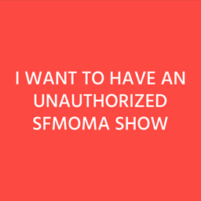

<h3>Unauthorized SFMOMA Show</h3>

<a href="https://sfmoma.show/" target="_blank">Website</a> | <a href="https://twitter.com/unsfmomashow" target="_blank">Twitter</a>

<a href="http://montenegrojaramillo.info/" target="_blank">Ana María Montenegro Jaramillo</a> from Colombia, <a href="http://lassescherffig.de/" target="_blank">Lasse Scherffig</a> from Germany, and <a href="http://www.enardediosrodriguez.com/" target="_blank">Enar de Dios Rodríguez</a> from Spain are three artists currently based in the Bay Area who are interested in exhibition making, online curating and institutional critique considering how Internet has changed the way art is seen, experienced and valued. Unauthorized SFMOMA Show is their first collaboration.

<h2>Presenting</h2>
<h3>Unauthorized SFMOMA Show</h3>

Unauthorized SFMOMA Show was a series of solo shows that took place within SFMOMA’s public spaces from April 6th - July 2nd on a rotating basis. The only requirement to visit an Unauthorized SFMOMA Show was to be physically present at SFMOMA and have access to a device that could be connected to the Internet.

From the 460,000 square feet of the new SFMOMA building, only 45,000 square feet has been allocated as public space, where no ticket is required to visit. This space, with “art that is free-for-all” introduced the public to SFMOMA’s representation of the “art of our time”: Richard Serra’s Sequence, Sol LeWitt’s Wall Drawing 895: Loopy Doopy (white and blue), Alexander Calder’s Untitled, Chris Johanson’s I Do Not Know but Am Open to Learning and Susan O’Malley’s Advice from My 80-Year-Old Self. We consider this representation to be limiting and unhealthy. Unauthorized SFMOMA show allowed everybody to exhibit artworks within the public spaces of SFMOMA to foster a broader understanding of “the art of our time” as something different than art made by already known (90% male) white American artists. Through Unauthorized SFMOMA shows, which were free to visit and participate, we invited everybody to act as institutional agent by means of cultural creation, selection and propagation.

In order to participate in the exhibition, the submitter had to fill in a form and upload his/her work in digital format (.jpg, .png or .gif) through the website http://sfmoma.show. All works were accepted immediately upon their submission and automatically constituted an Unauthorized SFMOMA Solo Show. The period of each exhibition started when a work was submitted and ended when a new work was submitted. More than 600 Unauthorized SFMOMA Shows took place during the term of the project.

To visit the exhibition, the audience had to be physically present at SFMOMA’s public spaces and go to <a href="https://sfmoma.show/" target="_blank">http://sfmoma.show</a>, after allowing location access to Unauthorized SFMOMA Show in order to confirm the visitor’s location.

At the end of summer 2017 an exhibition catalog featuring all Unauthorized SFMOMA Shows will be printed and its digital version will be distributed among all artists and the wider public.
